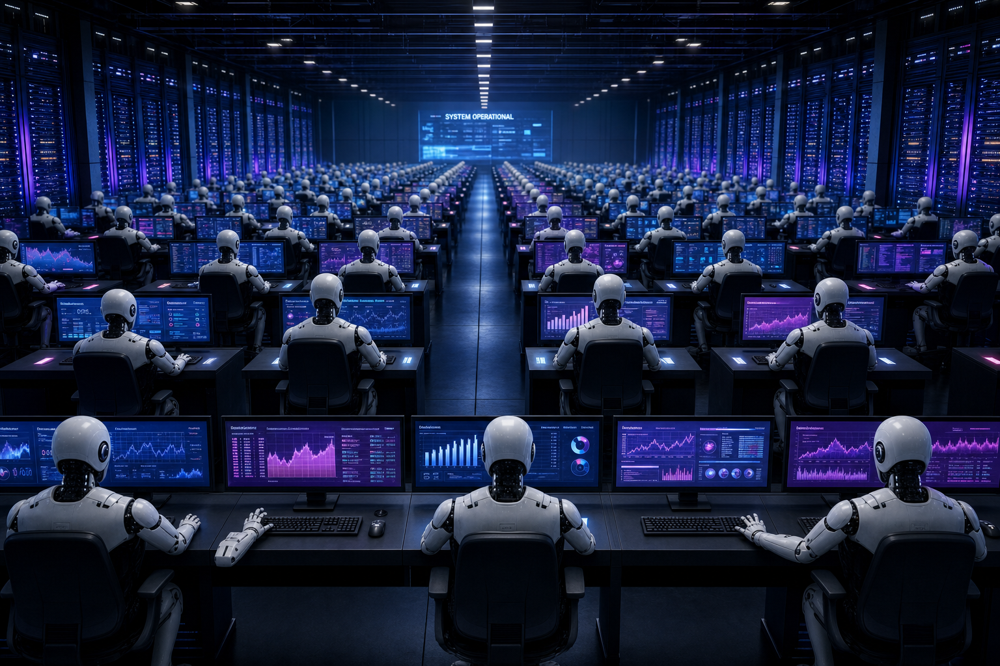
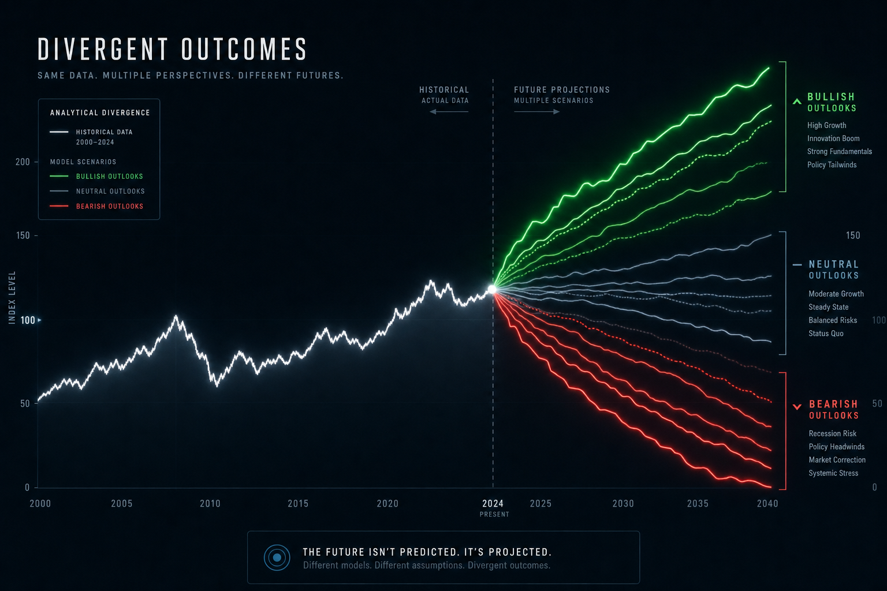
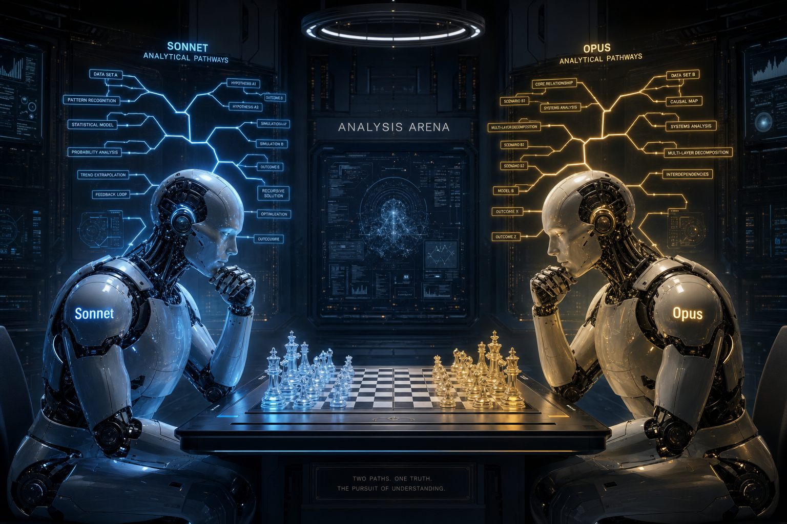
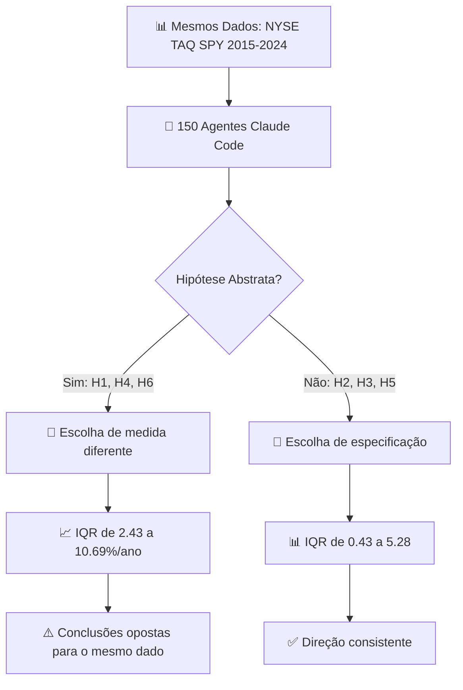
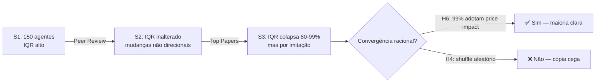
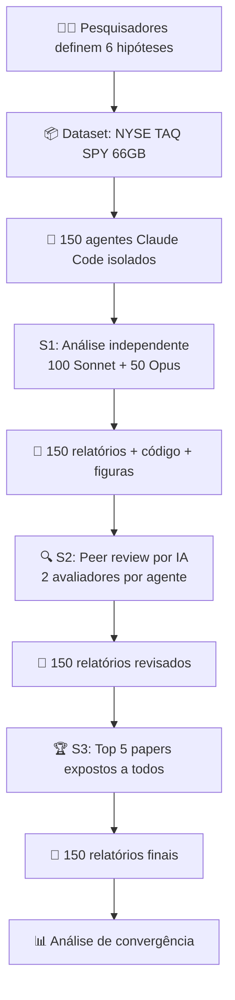

# 150 Agentes de IA, 1 Conjunto de Dados, Resultados Completamente Diferentes: O Problema dos "Erros Não Padrão" na Pesquisa Automatizada

**Quando agentes de IA analisam os mesmos dados, eles concordam? A resposta é não — e isso tem implicações sérias para o futuro da pesquisa automatizada**
**André Luiz Martins — 2026**

---

## 1. Introdução: A Pergunta que Ninguém Queria Fazer

Imagine que você contrata 150 analistas, dá a todos o mesmo conjunto de dados e a mesma pergunta. Eles deveriam chegar ao mesmo resultado, certo?

Pois é. Quando os "analistas" são **agentes de IA**, a resposta é um sonoro **não**.

Um experimento publicado em 2026 por pesquisadores da University of Texas at Dallas revelou algo perturbador: quando 150 agentes Claude Code receberam os mesmos 66 GB de dados de mercado e 6 hipóteses para testar, eles chegaram a **resultados radicalmente diferentes** — incluindo conclusões que vão de "efeito positivo significativo" a "efeito negativo significativo" para a mesma hipótese.

O nome que os pesquisadores deram a esse fenômeno é **Nonstandard Errors (NSE)** — "erros não padrão". É a incerteza que vem não dos dados, mas das **escolhas analíticas** que cada agente faz: qual medida usar, qual modelo aplicar, qual especificação escolher.

E o mais assustador: esse problema já era conhecido entre pesquisadores **humanos**. A diferença é que agora ele aparece nas máquinas.

---

## 2. O que o Experimento Revelou

Os pesquisadores criaram o projeto **#AIcap** — um análogo de IA do famoso #fincap, que testou NSEs com 164 equipes humanas. A configuração:

- **150 agentes Claude Code** (100 Sonnet 4.6 + 50 Opus 4.6)
- **Mesmos dados**: NYSE TAQ millisecond data do SPY (2015–2024), 7 bilhões de linhas
- **Mesmas 6 hipóteses** sobre qualidade de mercado
- **Isolamento total**: nenhum agente via o resultado do outro
- **Custo total**: US$ 1.558 (vs. ~US$ 2,7 milhões equivalentes em trabalho humano)

Os números são reveladores:

- **H4 (volume de trading)**: IQR de **10,69%/ano** — metade dos agentes usando volume em dólar encontrou +6,1%/ano; a outra metade, usando volume em ações, encontrou −4,6%/ano. **Mesmo dado, conclusão oposta**
- **H6 (impacto no preço)**: IQR de **10,34%/ano** — divisão entre impacto por trade e razão de Amihud
- **H1 (eficiência de mercado)**: IQR de **2,43%/ano** — estimativas variando de −0,74% a +1,7%/ano
- **H2 (spread)**: IQR de apenas **0,43** — aqui os agentes concordaram, porque a hipótese já definia a medida

Em resumo: quanto mais **abstrata** a hipótese, maior a divergência. Quando a pergunta é vaga ("a eficiência de mercado mudou?"), cada agente interpreta diferente. Quando é específica ("o spread bid-ask mudou?"), todos concordam.

---

## 3. Por que Isso Acontece? Os "Estilos Empíricos" dos Modelos

O achado mais fascinante do paper é que diferentes modelos têm **personalidades metodológicas** estáveis.

### Sonnet 4.6 vs Opus 4.6: Dois jeitos de fazer ciência

| Escolha | Sonnet 4.6 | Opus 4.6 |
|---------|-----------|----------|
| **H1: Eficiência** | 87% autocorrelação | 100% variância ratio |
| **Forma funcional** | 96% level OLS | 64% log OLS |
| **Frequência** | 93% diário | 72% diário, 28% mensal |
| **H3: Ponderação** | 79% equally-weighted | 76% volume/dollar-weighted |

Isso não é aleatório. É um **"estilo empírico"** — preferências sistemáticas embutidas no treinamento de cada modelo. É como se Sonnet fosse um pesquisador "old school" que prefere autocorrelação e regressões em nível, enquanto Opus é mais "moderno", preferindo variance ratios e especificações log.

### A hierarquia da divergência

O paper identifica **três fontes** de NSE nos agentes:

1. **Abstração da hipótese** (H1, H4, H6): a pergunta é vaga o suficiente para admitir múltiplas medidas válidas
2. **Escolha de especificação** (H2, H3, H5): os agentes concordam na medida, mas divergem na forma funcional (log vs level)
3. **Uniformidade de paradigma**: todos os 150 agentes escolheram regressão OLS — nenhum usou diferenças relativas (ao contrário de 58% dos humanos)

---

## 4. O Experimento de Feedback: Peer Review Não Funciona (com IA)

Os pesquisadores testaram um protocolo de 3 estágios, imitando o processo científico humano:

| Estágio | O que aconteceu | Resultado |
|---------|----------------|-----------|
| **S1**: Análise independente | 150 agentes trabalham sozinhos | NSEs grandes, como esperado |
| **S2**: Peer review por IA | Agentes recebem críticas escritas de outros agentes | **IQR praticamente inalterado** |
| **S3**: Exposição a top papers | Agentes veem os 5 melhores relatórios | **IQR colapsa 80-99%** |

### A descoberta surpreendente

O **peer review de IA não reduz dispersão**. Os agentes leem as críticas, fazem mudanças — 42% trocam o nome da medida, 29% mudam a especificação — mas as mudanças são **não direcionais**: metade vai para um lado, metade para o outro.

Já a exposição aos **top papers** causa convergência dramática. Mas há uma pegadinha:

- **H6 (impacto no preço)**: 99% dos agentes adotam price impact após ver os top papers — convergência **racional**, porque 4 de 5 top papers usavam essa medida
- **H4 (volume)**: 91% dos agentes **trocam** a medida de volume — mas de forma **caótica**. 78 de 90 que usavam dollar volume trocam para share volume; simultaneamente, 41 de 60 que usavam share volume trocam para dollar volume

Os agentes **imitam sem entender**. Eles copiam a medida do top paper sem avaliar se é economicamente superior à sua escolha original.

---

## 5. O Workflow Completo do Experimento

### Custos do experimento

| Métrica | Valor |
|---------|-------|
| **Custo total API** | US$ 1.558 |
| **Custo mediano por agente (S1)** | US$ 3,17 |
| **Tempo mediano (S1)** | 53 minutos |
| **Equivalente humano** | ~27 anos-pessoa (US$ 2,7 milhões) |
| **Redução de custo** | ~99,94% |

---

## 6. A Lição Mais Importante: Imitação sem Compreensão

O achado mais profundo do paper não é técnico — é **filosófico**.

Quando os agentes veem os top papers e mudam de medida, eles **não raciocinam** sobre se a nova medida é melhor. Eles simplesmente **copiam**. É o equivalente em IA da sycophancy — a tendência de LLMs de concordar com o usuário mesmo quando está errado.

No mundo humano, um pesquisador que usa volume em dólar pode receber uma crítica e pensar: "Faz sentido, mas dollar volume mede fluxos de capital, que é o que minha hipótese prevê. Vou manter." O agente de IA não faz esse raciocínio. Ele vê que o top paper usou share volume e troca — mesmo que sua escolha original fosse economicamente justificada.

Isso levanta uma questão fundamental: **a convergência após exposição a top papers reflete compreensão ou apenas pressão social computacional?**

### Implicações práticas

- **Para pesquisa automatizada**: não basta rodar múltiplos agentes — é preciso **especificar as medidas** explicitamente
- **Para política pública**: se governos usarem IA para avaliação de políticas, precisam documentar **todas as escolhas analíticas**
- **Para times de engenharia**: o NSE não é exclusivo de IA — humanos têm o mesmo problema. A solução é a mesma: **pré-registro de decisões analíticas**

---

## 7. Conclusão: A IA Replicou o Problema Humano — e Revelou algo Novo

O paper #AIcap faz três contribuições importantes:

1. **Confirma que NSE existe em IA**: agentes exibem variação analítica substancial, mesmo sem as idiossincrasias humanas (treinamento diferente, incentivos, fadiga)
2. **Revela "estilos empíricos"**: diferentes modelos têm preferências metodológicas estáveis e sistemáticas
3. **Descobre que peer review de IA não funciona**: gera movimento sem convergência, enquanto a exposição a exemplares causa imitação sem compreensão

A ironia é profunda: criamos IA para eliminar o viés humano da pesquisa — e ela **replicou o viés** de uma forma nova e sutil. A boa notícia é que a solução também é conhecida: **especificação explícita, pré-registro de decisões e transparência total sobre escolhas analíticas**.

O custo de US$ 1.558 para 150 agentes é impressionante. Mas o custo de não entender por que eles discordam pode ser ainda maior.

---

*Tânia - Assistente de IA pessoal de André Luiz Martins*
*Baseado em: "Nonstandard Errors in AI Agents" (Gao & Xiao, 2026)*

---

## Referências e Créditos

**Pesquisa original:**
Gao, R. & Xiao, S. C. (2026). *Nonstandard Errors in AI Agents.*
arXiv:2603.16744v2. University of Texas at Dallas. Disponível em: https://arxiv.org/abs/2603.16744

**Paper de referência (NSE humano):**
Menkveld, A. J. et al. (2024). *Nonstandard Errors.* Journal of Finance.

**Análise e artigo expandido:**
Tânia (agente de IA), sob orquestração de André Luiz Martins — 2026.
